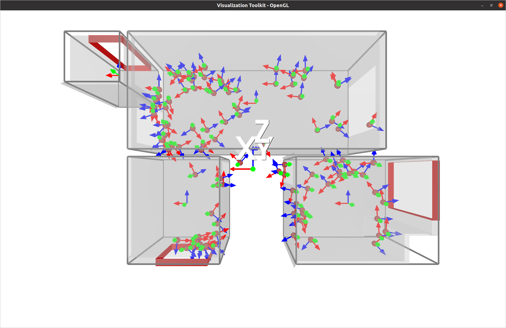
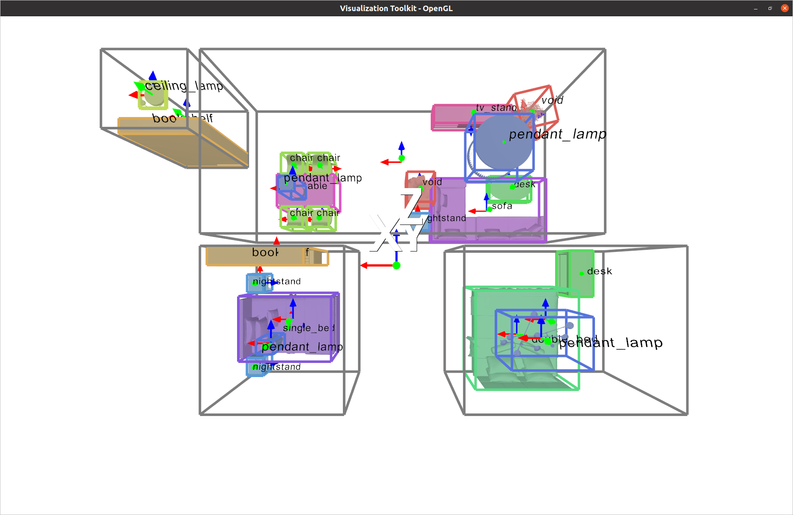

# BlenderProc2 for 3D-Front
Support BlenderProc2 with **multi-GPU batch rendering** and **3D visualization** for the 3D-Front dataset.

If you feel struggled in rendering 3D-Front or visualizing its 3D assets for your tasks. Here is a solution based on [BlenderProc2](https://github.com/DLR-RM/BlenderProc) and [VTK](https://vtk.org/).

#### 2D rendering
|                             RGB                              |                            Depth                             |                         Semantics                          |                          Instances                          |
|:------------------------------------------------------------:|:------------------------------------------------------------:|:----------------------------------------------------------:|:-----------------------------------------------------------:|
|  |  |  |  | 


Please check the orginal [REAME](README_BlenderProc2.md) if you want to know all the functions in BlenderProc2.

#### 3D visualization
|                  Pointcloud                   |                Layout & Camera                |   CAD models + Oriented Bounding boxes    |
|:---------------------------------------------:|:---------------------------------------------:|:-----------------------------------------:|
|  |  |  | 


---

### Install
1. Use [conda](https://docs.conda.io/en/latest/miniconda.html) to deploy the environment by
    ```python
    conda create -n blenderproc python=3.8
    conda activate blenderproc
    pip install -e .
    ```

2. Apply for the [3D-Front dataset](https://tianchi.aliyun.com/specials/promotion/alibaba-3d-scene-dataset). Download all the data and link them to the local directory as follows:
    ```
   examples/datasets/front_3d_with_improved_mat/3D-FRONT
   examples/datasets/front_3d_with_improved_mat/3D-FRONT-texture
   examples/datasets/front_3d_with_improved_mat/3D-FUTURE-model
    ```

3. Download textures data from [link](https://ambientcg.com/) by
   ```commandline
   BlenderProc/blenderproc/scripts/download_cc_textures.py
   ```

---
### Render
1. **Single scene rendering**

   Here we take the scene ID `baf392b9-fb6f-4a9d-ab29-f542e0f80045.json` as an example. We can do multi-view renderings by running the script as follows:  
   ```commandline
   blenderproc run \
   examples/datasets/front_3d_with_improved_mat/render_dataset_improved_mat.py \
   examples/datasets/front_3d_with_improved_mat/3D-FRONT \
   examples/datasets/front_3d_with_improved_mat/3D-FUTURE-model \
   examples/datasets/front_3d_with_improved_mat/3D-FRONT-texture \
   baf392b9-fb6f-4a9d-ab29-f542e0f80045.json \
   resources/cctextures/ \
   examples/datasets/front_3d_with_improved_mat/renderings
   ```
   * The rendering results will be saved in `examples/datasets/front_3d_with_improved_mat/renderings`. 
   * You can also customize your *camera FOV*, *rendering resolution* and *number of views*, etc. in `render_dataset_improved_mat.py`. Just dive deeper and play with it.
   * You can also output normal maps or depth maps by uncomment `bproc.renderer.enable_normals_output()` and `bproc.renderer.enable_depth_output(activate_antialiasing=False)`.
   * I customized the camera pose sampling function to support multi-view renderings. The sampling strategy ensures every camera pose has a reasonable object surface coverage.
   * The number of camera poses in a room is proportional to the ratio of its floor area to the whole apartment. Default camera pose number is 100 per apartment.

2. **Batch scene rendering (support multi-GPU mode for parallel rendering)**

   This script is built on the above function to support batch rendering. Run the following script to render all scenes in a loop.
   ```commandline
   python examples/datasets/front_3d_with_improved_mat/multi_render.py \
   examples/datasets/front_3d_with_improved_mat/render_dataset_improved_mat.py \
   examples/datasets/front_3d_with_improved_mat/3D-FRONT \
   examples/datasets/front_3d_with_improved_mat/3D-FUTURE-model \
   examples/datasets/front_3d_with_improved_mat/3D-FRONT-texture \
   resources/cctextures/ \
   examples/datasets/front_3d_with_improved_mat/renderings \
   --n_processes 1
   ```
   * The rendering results will be saved in `examples/datasets/front_3d_with_improved_mat/renderings`.
   * You can still customize your rendering pipeline by modifying `render_dataset_improved_mat.py`. 
   * If you have multiple GPUs and want to render in parallel, change `n_processes` to your GPU number. 

Citations:
ATISS, My work, BlenderProc