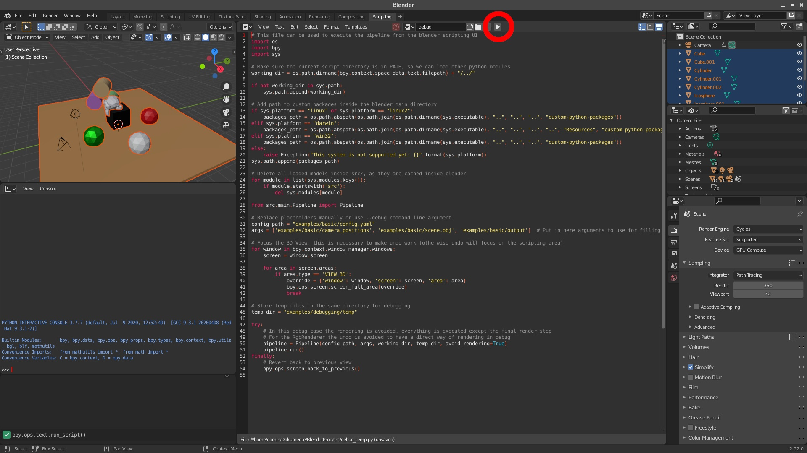

# BlenderProc2 for 3D-Front
Support BlenderProc2 with **multi-GPU batch rendering** and **3D visualization** for the 3D-Front dataset.

If you feel struggled in rendering 3D-Front or visualizing its 3D assets for your tasks. Here is a solution based on [BlenderProc2](https://github.com/DLR-RM/BlenderProc) and [VTK](https://vtk.org/).

#### 2D rendering
|                                 RGB                                 |                                Depth                                |                             Semantics                             |                             Instances                              |
|:-------------------------------------------------------------------:|:-------------------------------------------------------------------:|:-----------------------------------------------------------------:|:------------------------------------------------------------------:|
|  |  |  |  |
|  |  |  |  |


#### 3D visualization
|                                Pointcloud                                |                          Layout & Camera Poses                           |                 CAD models + Oriented Bounding Boxes                 |
|:------------------------------------------------------------------------:|:------------------------------------------------------------------------:|:--------------------------------------------------------------------:|
|  |  |  |
|  |  |  |

*Note*:
* X server is required for 3D visualization only (i.e., You can render on a remote headless server, then visualize the 3D contents interactively with your local machine).
* [OpenGL camera setting](http://www.songho.ca/opengl/gl_camera.html) is used.


## Installation

### Via pip

The simplest way to install blenderproc is via pip:

```bash
pip install blenderproc
```

### Git clone

If you need to make changes to blenderproc or you want to make use of the most recent version on the main-branch, clone the repository:

```bash
git clone https://github.com/DLR-RM/BlenderProc
```

To still make use of the blenderproc command and therefore use blenderproc anywhere on your system, make a local pip installation:

```bash
cd BlenderProc
pip install -e .
```

## Usage

BlenderProc has to be run inside the blender python environment, as only there we can access the blender API. 
Therefore, instead of running your script with the usual python interpreter, the command line interface of BlenderProc has to be used.

```bash
blenderproc run <your_python_script>
```

In general, one run of your script first loads or constructs a 3D scene, then sets some camera poses inside this scene and renders different types of images (RGB, distance, semantic segmentation, etc.) for each of those camera poses.
Usually, you will run your script multiple times, each time producing a new scene and rendering e.g. 5-20 images from it.
With a little more experience, it is also possible to change scenes during a single script call, read [here](docs/tutorials/key_frames.md#render-multiple-times) how this is done.

## Quickstart

You can test your BlenderProc pip installation by running

```bash
blenderproc quickstart
```

This is an alias to `blenderproc run quickstart.py` where `quickstart.py` is:

```python
import blenderproc as bproc
import numpy as np

bproc.init()

# Create a simple object:
obj = bproc.object.create_primitive("MONKEY")

# Create a point light next to it
light = bproc.types.Light()
light.set_location([2, -2, 0])
light.set_energy(300)

# Set the camera to be in front of the object
cam_pose = bproc.math.build_transformation_mat([0, -5, 0], [np.pi / 2, 0, 0])
bproc.camera.add_camera_pose(cam_pose)

# Render the scene
data = bproc.renderer.render()

# Write the rendering into an hdf5 file
bproc.writer.write_hdf5("output/", data)
```

BlenderProc creates the specified scene and renders the image into `output/0.hdf5`.
To visualize that image, simply call:

```bash
blenderproc vis hdf5 output/0.hdf5
```

Thats it! You rendered your first image with BlenderProc!

### Debugging in the Blender GUI

To understand what is actually going on, BlenderProc has the great feature of visualizing everything inside the blender UI.
To do so, simply call your script with the `debug` instead of `run` subcommand:
```bash
blenderproc debug quickstart.py
```

Now the Blender UI opens up, the scripting tab is selected and the correct script is loaded.
To start the BlenderProc pipeline, one now just has to press `Run BlenderProc` (see red circle in image).
As in the normal mode, print statements are still printed to the terminal.

<p align="center">

</p>

The pipeline can be run multiple times, as in the beginning of each run the scene is cleared.

### Breakpoint-Debugging in IDEs

As blenderproc runs in blenders separate python environment, debugging your blenderproc script cannot be done in the same way as with any other python script.
Therefore, remote debugging is necessary, which is explained for vscode and PyCharm in the following:

#### Debugging with vscode

First, install the `debugpy` package in blenders python environment.

```
blenderproc pip install debugpy
```

Now add the following configuration to your vscode [launch.json](https://code.visualstudio.com/docs/python/debugging#_initialize-configurations).

```json
{                        
    "name": "Attach",
    "type": "python",
    "request": "attach",
    "connect": {
        "host": "localhost",
        "port": 5678
    }
}
```

Finally, add the following lines to the top (after the imports) of your blenderproc script which you want to debug.

```python
import debugpy
debugpy.listen(5678)
debugpy.wait_for_client()
```

Now run your blenderproc script as usual via the CLI and then start the added "Attach" configuration in vscode.
You are now able to add breakpoints and go through the execution step by step.

#### Debugging with PyCharm Professional

In Pycharm, go to `Edit configurations...` and create a [new configuration](https://www.jetbrains.com/help/pycharm/remote-debugging-with-product.html#remote-debug-config) based on `Python Debug Server`.
The configuration will show you, specifically for your version, which pip package to install and which code to add into the script.
The following assumes Pycharm 2021.3:

First, install the `pydevd-pycharm` package in blenders python environment.

```
blenderproc pip install pydevd-pycharm~=212.5457.59
```

Now, add the following code to the top (after the imports) of your blenderproc script which you want to debug.

```python
import pydevd_pycharm
pydevd_pycharm.settrace('localhost', port=12345, stdoutToServer=True, stderrToServer=True)
```

Then, first run your `Python Debug Server` configuration in PyCharm and then run your blenderproc script as usual via the CLI.
PyCharm should then go in debug mode, blocking the next code line.
You are now able to add breakpoints and go through the execution step by step.

## What to do next?

As you now ran your first BlenderProc script, your ready to learn the basics:

### Tutorials

Read through the tutorials, to get to know with the basic principles of how BlenderProc is used:

1. [Loading and manipulating objects](docs/tutorials/loader.md)
2. [Configuring the camera](docs/tutorials/camera.md)
3. [Rendering the scene](docs/tutorials/renderer.md)
4. [Writing the results to file](docs/tutorials/writer.md)
5. [How key frames work](docs/tutorials/key_frames.md)
6. [Positioning objects via the physics simulator](docs/tutorials/physics.md)

### Examples

We provide a lot of [examples](examples/README.md) which explain all features in detail and should help you understand how BlenderProc works. Exploring our examples is the best way to learn about what you can do with BlenderProc. We also provide support for some datasets.

* [Basic scene](examples/basics/basic/README.md): Basic example, this is the ideal place to start for beginners
* [Camera sampling](examples/basics/camera_sampling/README.md): Sampling of different camera positions inside of a shape with constraints for the rotation.
* [Object manipulation](examples/basics/entity_manipulation/README.md): Changing various parameters of objects.
* [Material manipulation](examples/basics/material_manipulation/README.md): Material selecting and manipulation.
* [Physics positioning](examples/basics/physics_positioning/README.md): Enabling simple simulated physical interactions between objects in the scene.
* [Semantic segmentation](examples/basics/semantic_segmentation/README.md): Generating semantic segmentation labels for a given scene.
* [BOP Challenge](README_BlenderProc4BOP.md): Generate the pose-annotated data used at the BOP Challenge 2020
* [COCO annotations](examples/advanced/coco_annotations/README.md): Write COCO annotations to a .json file for selected objects in the scene.

and much more, see our [examples](examples/README.md) for more details.


## Contributions

Found a bug? help us by reporting it. Want a new feature in the next BlenderProc release? Create an issue. Made something useful or fixed a bug? Start a PR. Check the [contributions guidelines](CONTRIBUTING.md).

## Change log

See our [change log](change_log.md). 

## Citation 

If you use BlenderProc in a research project, please cite as follows:

```
@article{denninger2019blenderproc,
  title={BlenderProc},
  author={Denninger, Maximilian and Sundermeyer, Martin and Winkelbauer, Dominik and Zidan, Youssef and Olefir, Dmitry and Elbadrawy, Mohamad and Lodhi, Ahsan and Katam, Harinandan},
  journal={arXiv preprint arXiv:1911.01911},
  year={2019}
}
```

---

### Install
1. Use [conda](https://docs.conda.io/en/latest/miniconda.html) to deploy the environment by
    ```commandline
    cd BlenderProc-3DFront
    conda env create -f environment.yml
    conda activate blenderproc
    pip install -e .
    ```

2. Apply for the [3D-Front dataset](https://tianchi.aliyun.com/specials/promotion/alibaba-3d-scene-dataset). Download all the data and link them to the local directory as follows:
    ```
   examples/datasets/front_3d_with_improved_mat/3D-FRONT
   examples/datasets/front_3d_with_improved_mat/3D-FRONT-texture
   examples/datasets/front_3d_with_improved_mat/3D-FUTURE-model
    ```
   Move our improved 3D-Future `model_info.json` to the `3D-FUTURE-model` folder by
   ```
   mv examples/datasets/front_3d_with_improved_mat/model_info_revised.json examples/datasets/front_3d_with_improved_mat/3D-FUTURE-model
   ```
   
3. Download textures data from [link](https://ambientcg.com/) by
   ```commandline
   blenderproc run blenderproc/scripts/download_cc_textures.py ./resources/cctextures
   ```

---
### Render
Since I use Ubuntu system, BlenderProc will automatically install [blender-3.0.0-linux-x64](https://download.blender.org/release/Blender3.0/) in `/home/USERNAME/blender/blender-3.0.0-linux-x64`. In any case you meet any problems or bugs, here I provide my [Blender version](https://drive.google.com/file/d/1VUCrSFP_lzMPYAJ9Z-2nfhYRP2t4YTez/view?usp=sharing). Please download to the same folder before rendering.  

1. **Single scene rendering**

   Here we take the scene ID `6a0e73bc-d0c4-4a38-bfb6-e083ce05ebe9.json` as an example. We can do multi-view renderings by running the script as follows:  
   ```commandline
   blenderproc run \
   examples/datasets/front_3d_with_improved_mat/render_dataset_improved_mat.py \
   examples/datasets/front_3d_with_improved_mat/3D-FRONT \
   examples/datasets/front_3d_with_improved_mat/3D-FUTURE-model \
   examples/datasets/front_3d_with_improved_mat/3D-FRONT-texture \
   6a0e73bc-d0c4-4a38-bfb6-e083ce05ebe9.json \
   resources/cctextures/ \
   examples/datasets/front_3d_with_improved_mat/renderings
   ```
   * The rendering results will be saved in `examples/datasets/front_3d_with_improved_mat/renderings`. 
   * You can also customize your *camera FOV*, *rendering resolution* and *number of views*, etc. in `render_dataset_improved_mat.py`. Just dive deeper and play with it.
   * You can also output normal maps or depth maps by uncomment `bproc.renderer.enable_normals_output()` and `bproc.renderer.enable_depth_output(activate_antialiasing=False)`.
   * I customized the camera pose sampling function to support multi-view renderings. The sampling strategy ensures every camera pose has a reasonable object surface coverage.
   * The number of camera poses in a room is proportional to the ratio of its floor area to the whole apartment. Default camera pose number is 100 per apartment.

2. **Batch scene rendering (support multi-GPU mode for parallel rendering)**

   This script is built on the above function to support batch rendering. Run the following script to render all scenes in a loop.
   ```commandline
   python examples/datasets/front_3d_with_improved_mat/multi_render.py \
   examples/datasets/front_3d_with_improved_mat/render_dataset_improved_mat.py \
   examples/datasets/front_3d_with_improved_mat/3D-FRONT \
   examples/datasets/front_3d_with_improved_mat/3D-FUTURE-model \
   examples/datasets/front_3d_with_improved_mat/3D-FRONT-texture \
   resources/cctextures/ \
   examples/datasets/front_3d_with_improved_mat/renderings \
   --n_processes 1
   ```
   * The rendering results will be saved in `examples/datasets/front_3d_with_improved_mat/renderings`.
   * You can still customize your rendering pipeline by modifying `render_dataset_improved_mat.py`. 
   * If you have multiple GPUs and want to render in parallel, change `n_processes` to your GPU number. 

---
### Visualization
After rendering a scene, please run the following code for 2D and 3D visualizations
```commandline
python visualization/front3d/vis_front3d.py --json_file 6a0e73bc-d0c4-4a38-bfb6-e083ce05ebe9.json
```

### How to Debug?
Please refer to [link](https://github.com/DLR-RM/BlenderProc#breakpoint-debugging-in-ides) if you want to debug with your IDE. 

### Citation 
Some parts of this code base is developed based on the following works. If you find our work helpful, please consider citing
```
@inproceedings{nie2023learning,
  title={Learning 3d scene priors with 2d supervision},
  author={Nie, Yinyu and Dai, Angela and Han, Xiaoguang and Nie{\ss}ner, Matthias},
  booktitle={Proceedings of the IEEE/CVF Conference on Computer Vision and Pattern Recognition},
  pages={792--802},
  year={2023}
}

@article{Denninger2023, 
    doi = {10.21105/joss.04901},
    url = {https://doi.org/10.21105/joss.04901},
    year = {2023},
    publisher = {The Open Journal}, 
    volume = {8},
    number = {82},
    pages = {4901}, 
    author = {Maximilian Denninger and Dominik Winkelbauer and Martin Sundermeyer and Wout Boerdijk and Markus Knauer and Klaus H. Strobl and Matthias Humt and Rudolph Triebel},
    title = {BlenderProc2: A Procedural Pipeline for Photorealistic Rendering}, 
    journal = {Journal of Open Source Software}
} 

@InProceedings{Paschalidou2021NEURIPS,
  author = {Despoina Paschalidou and Amlan Kar and Maria Shugrina and Karsten Kreis and Andreas Geiger
  and Sanja Fidler},
  title = {ATISS: Autoregressive Transformers for Indoor Scene Synthesis},
  booktitle = {Advances in Neural Information Processing Systems (NeurIPS)},
  year = {2021}
}
```
